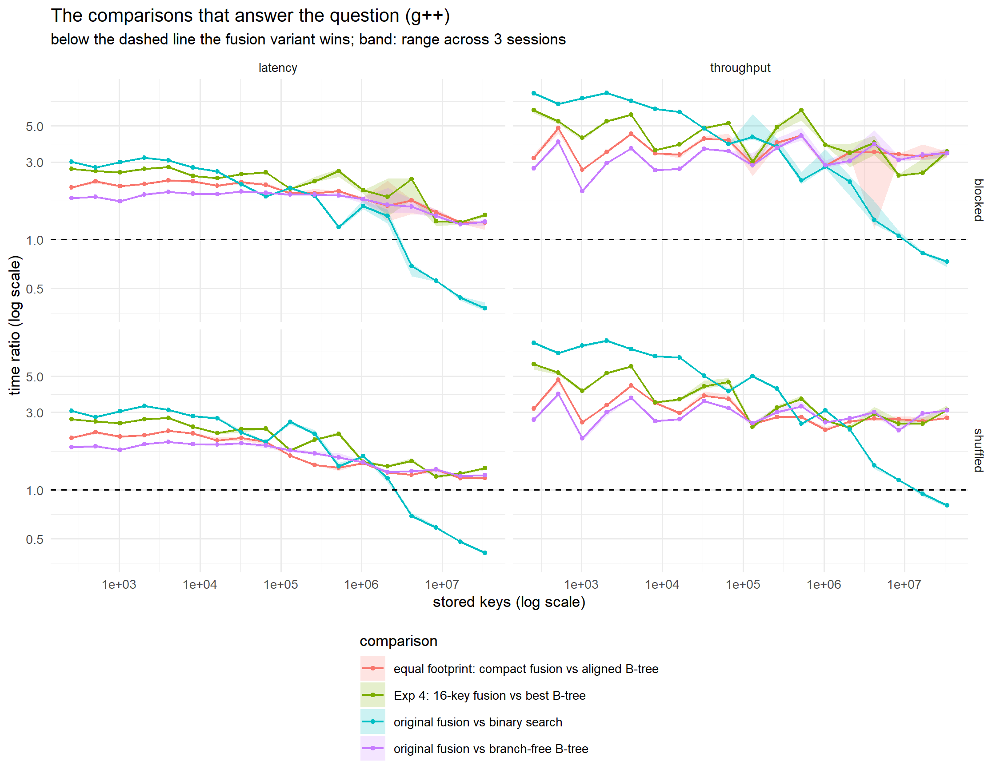

# Fusion Tree — Galactic Algorithms, Measured

> **New here? Start with [docs/START_HERE.md](docs/START_HERE.md).** It takes
> you from nothing installed to your first result.
>
> **For a simple explanation of the project** Read
> [docs/THE_WHOLE_STORY.md](docs/Explanation.md), a simple, chapter-by-chapter
> explanation of the project and its current progress.
>
> | Guide | For |
> |---|---|
> | [THE_WHOLE_STORY](docs/Explanation.md) | an explanation of the entire project and its current progress |
> | [START_HERE](docs/START_HERE.md) | installing, building, testing, your first race |
> | [GLOSSARY](docs/GLOSSARY.md) | every technical word |
> | [STRUCTURES](docs/STRUCTURES.md) | what each search method does |
> | [EXPERIMENTS](docs/EXPERIMENTS.md) | every question asked, and the answer |
> | [PROGRAMS](docs/PROGRAMS.md) | how to run each program, and what its output means |
> | [REPO_MAP](docs/REPO_MAP.md) | what every folder and file is for |
> | [TROUBLESHOOTING](docs/TROUBLESHOOTING.md) | fixes for common problems |

The fusion tree (Fredman & Willard, 1993) answers predecessor queries in
O(log_w n) time, beating the Ω(log n) comparison bound. It is the textbook
example of a *galactic algorithm*: provably faster, universally assumed to be
useless in practice, and almost never measured. This repository measures it.

**Research question.** Does a correctly implemented fusion tree ever beat a
cache-conscious B-tree or binary search on real hardware, and if not, which
mechanism is responsible?

## The result

**It beats binary search at large sizes, as its theory says it should. It
never beats a B-tree, and the gap grows.** Nanoseconds per predecessor query
at 2^25 keys (33.5 million), g++, median of three sessions on an idle machine:

| structure | throughput | latency |
|---|---|---|
| B-tree, 8 keys, branch-free (AVX2) | **186** | **475** |
| B-tree, 8 keys, early-exit | 442 | 468 |
| fusion tree, compact 128-byte node | 527 | 537 |
| fusion tree, original | 579 | 577 |
| fusion tree, 16 keys on a 256-bit word | 576 | 611 |
| binary search | 723 | 1407 |

*Every comparison, both timing modes (columns) and both run orders (rows).
Below the dashed line the fusion variant wins; the band is the range across
three sessions. Only the comparison against plain binary search ever crosses.*

**Against binary search the 1993 claim is visible.** Binary search is the
comparison-based method the Ω(log n) lower bound describes. The fusion tree is
faster than it at every size from 2^22 keys in latency and from 2^24 in
throughput (577 vs 1407 ns and 579 vs 723 ns at 2^25).

**But the win is not the fusion tree's own.** The early-exit B-tree is purely
comparison-based, bound by the same Ω(log n), and it beats binary search
sooner (from 2^21 in latency, 2^23 in throughput) and by more. What wins is a
multiway node a few cache lines long: the lower bound counts comparisons, but
the time here goes into moving memory, and in the external-memory model
B-trees are already optimal. At w = 64 the fusion tree's own asymptotic gain,
a factor of log w in height, cannot appear: K ≤ 8 gives it exactly the height
of an 8-key B-tree, leaving only the cost of a node search, which it loses.

Against the B-tree, four independent lines of evidence agree on why:

1. **It executes more instructions, not fewer.** Measured with hardware
   counters (Intel VTune): 441 instructions per query against the B-tree's
   200, and 730 cycles against 291 — 2.2× the work, 2.5× the cycles.
2. **Its node search is a long dependency chain.** ~60 cycles against ~28
   for a vectorised B-tree scan, with everything resident in L1.
3. **Memory traffic is a minor factor.** Given a node of identical size
   (128 bytes) and identical measured cache-line traffic, the fusion tree is
   still 2.8× slower in throughput and 1.2× in latency at 2^25.
4. **No crossover exists.** The latency ratio falls (1.8× → 1.2×) only
   because both structures wait longer on memory as n grows; the *absolute*
   deficit rises from 18 ns to 102 ns per query. A method that falls further
   behind cannot cross over.

**The 1993 construction does not fit a 64-bit word.** Its multiplication
sketch packs K fields only for K ≤ 4 (K = 8: 0% of random key sets). The
implementations here are viable only because of `PEXT` (BMI2, 2013). A
256-bit word does not rescue the multiplication sketch either: it fits
reliably only up to K ≈ 6. That limit is the multiplication sketch's alone.
A PEXT sketch needs just K − 1 bits per field, so it is bound only by
K² ≤ w, which is why `fusion16_w` (PEXT, 16 keys, 256 bits) exists.

Full write-ups: `Experiments_Report_2026-09-10.docx` (all four experiments,
mechanism, ablations) and `Work_Log_2026-09-10.docx` (what was built and why).
Figures: `figures/final_*_v3.png`.

## Beating the S+ tree

A follow-up question: can anything beat the **S+ tree** (Slotin), the fastest
known static search tree, including on clustered keys? Two new structures,
tested under a plan written before they were timed
(`results/spline_pilot/PLAN.md`): tuning on one seed, then confirmation on
three fresh ones. A win is claimed only if it holds in all three sessions.

At 2^25 keys, time ÷ the faster S+ tree (8 or 16 keys per node), median of three
sessions [range]. Clustered keys: 64 dense clusters, queries drawn the same way.

| structure | mode | uniform keys | clustered keys |
|---|---|---|---|
| **clusterjump** | throughput | **0.45** [0.44–0.45] | **0.40** [0.40–0.42] |
| **clusterjump** | latency | 1.01 [1.00–1.01] (tie) | **0.92** [0.90–0.93] |
| spline32 | throughput | 1.21 [1.21–1.23] | 1.21 [1.19–1.25] |
| spline32 | latency | **0.84** [0.83–0.85] | **0.84** [0.83–0.86] |

- **On clustered keys, ClusterJump beats the S+ tree in both modes:** 2.5×
  the throughput (from 2^15 keys up), and 8% lower latency (confirmed at 2^25
  only; at 2^24 not every session).
- **On uniform keys it is 2.2× faster in throughput** (from 2^10 up) and ties
  in latency.
- **SplineIndex (E = 32) wins latency by 16% on both key sets** (from 2^17 or
  2^19 up) but loses throughput by 21%. It was a post-hoc pick: the
  pre-registered rule chose E = 8, which beat the S+ tree nowhere.
- **Why they split.** Throughput rewards short searches: many overlap while
  each waits on memory, and a long search (SplineIndex: four S+ levels, a
  float prediction, a 17-compare window) crowds the others out. It is the
  fusion tree's lesson again. Latency rewards fewer memory waits in a row:
  SplineIndex waits on one uncached read, ClusterJump on two.
- **Limits.** ClusterJump adapts to clustering at one scale only. Nested
  clusters would defeat it; SplineIndex's error bound holds for any shape.
  One machine, static keys, two key distributions.

**On real data.** The same race on the four SOSD benchmark datasets
(200 million real keys each; plan in `results/realdata/PLAN.md`, fixed before
running), 2^25 keys sampled from each, time ÷ the faster S+ tree:

| dataset | clusterjump throughput | clusterjump latency | spline32 latency |
|---|---|---|---|
| books (Amazon sales) | **0.43** | **0.95** | **0.88** |
| wiki (edit times) | **0.43** | **0.95** | **0.82** |
| fb (user IDs) | **0.64** | 1.00 (tie) | 1.27 |
| osm (map cells) | **0.60** | 1.00 (tie) | 1.17 |

ClusterJump is 1.6–2.3× faster than the S+ tree in throughput on all four
real datasets, and ties or wins slightly in latency. SplineIndex's latency win
does not survive fb and osm.

**Against the learned indexes.** RadixSpline and PGM-index, the published
state of the art for this data (`third_party/`, one portability patch in
`third_party/PATCHES.md`), each tuned over its recommended settings by a rule
fixed in advance, and given the same final search step as ClusterJump. Plan
and results: `results/learned/PLAN.md`. ClusterJump time ÷ rival time at 2^25,
confirmed in three sessions:

| dataset | vs RadixSpline, throughput | vs PGM, throughput | vs RadixSpline, latency | vs PGM, latency |
|---|---|---|---|---|
| books | **0.73** | **0.42** | 1.21 | 1.26 |
| wiki | **0.76** | **0.42** | 1.28 | 1.31 |
| fb | **0.38** | **0.46** | **0.90** | 1.06 |
| osm | **0.68** | **0.44** | 1.13 | 1.12 |

- **Throughput: ClusterJump wins everywhere,** 1.3–2.6× faster than
  RadixSpline and 2.2–2.4× faster than PGM-index.
- **Latency: the learned indexes win,** by 6–31%. The one exception is fb,
  where ClusterJump beats RadixSpline by 10%.
- **Memory is a wash:** every structure uses 8.0–9.0 bytes per key, keys
  included (a bare array is 8.00). The learned indexes are slightly smaller.
- **Why they split.** It is the same trade-off seen throughout this
  repository. ClusterJump's search is very short, so many searches overlap
  while waiting on memory. A learned index's prediction is more accurate, so
  each search waits on memory fewer times in a row.
- Not compared: RMI, which needs a separate code generator per dataset.

**Clumps inside clumps: ClusterJump's weakness, confirmed.** Keys in 64
clusters, each made of 64 sub-clusters (`bench_pred ... nested`; plan in
`results/nested/PLAN.md`). ClusterJump loses to every rival, 1.6–2.2× slower,
and is even slower than the plain branch-free B-tree (throughput 197 ns
against the S+ tree's 110 and RadixSpline's 105). Its advantage needs
clustering at one scale.

**Data that changes.** `include/cluster_jump_dynamic.hpp` (ClusterJumpD)
accepts inserts. It gives every second-level slot a box of 16 keys and
rebuilds a bucket when too many boxes overflow. Its rivals are the TLX B+ tree
and ALEX, the best-known learned index for changing data (`third_party/`);
the dynamic PGM-index cannot step backwards, so it cannot answer "largest key
below q". Deletion is not supported. 2^24 keys, half bulk-loaded, then 8.4
million operations with 10% or 50% inserts; plan and results in
`results/dynamic/PLAN.md`. ClusterJumpD time ÷ rival time, three sessions:

| keys | vs TLX, 10% inserts | vs ALEX, 10% | vs TLX, 50% inserts | vs ALEX, 50% |
|---|---|---|---|---|
| uniform | **0.14** | **0.66** | **0.26** | **0.95** |
| clustered | **0.11** | **0.34** | **0.21** | **0.53** |
| books | **0.15** | **0.72** | **0.27** | **0.95** |
| wiki | **0.15** | **0.72** | **0.25** | **0.82** |
| osm | **0.27** | **0.53** | **0.51** | **0.73** |
| fb | 0.30 (tie) | 0.67 (tie) | 0.63 (tie) | 0.83 (tie) |

- **Faster than ALEX and TLX on five of six key sets**, with both insert shares.
- **fb exposes a bad worst case.** In one of three sessions ClusterJumpD was
  3.6× (10%) to 12× (50%) slower than ALEX. fb's few enormous IDs squeezed
  nearly all keys into one top bucket, and they piled into overflow lists of
  up to 47,000 keys (diagnosis in the plan).
- **It uses the most memory:** 15–19 bytes per key, and about 25 on fb and
  osm, against ALEX's 12–17.
- **ALEX has bugs of its own,** found by `tests/test_dynamic.cpp` and
  recorded in `third_party/PATCHES.md`: wrong answers for queries outside the
  key range (worked around in its wrapper), wrong answers for very closely
  spaced keys above 2^53, and a crash on one extreme input. ClusterJumpD and
  TLX: 465,888 checks each, zero failures. In the race itself every checksum
  agreed.

Build the changing-data programs as C++17 (ALEX needs it):

    g++ -O3 -std=c++17 -march=native -mbmi2 -Iinclude -Ithird_party/tlx -Ithird_party/ALEX/src/core -static tests/test_dynamic.cpp -o build/test_dynamic
    g++ -O3 -std=c++17 -march=native -mbmi2 -Iinclude -Ithird_party/tlx -Ithird_party/ALEX/src/core -static bench/bench_dyn.cpp -o build/bench_dyn
    Rscript analysis/dynamic_confirm.R

Correctness: the tree test now covers all 16 structures, 20,400,000 checks,
zero failures.

    powershell: foreach session s in 1..3, keys in uniform/clustered, mode in tput/lat:
      build\bench_pred.exe 15 25 8 <mode> shuffled sorted_array,btree8_bl,splus8,splus16,spline32,clusterjump <20260909+s> <keys>
        > results\spline_confirm\<mode>_<keys>_s<s>.csv
    Rscript analysis/confirm.R results/spline_confirm

## Scale of the measurement

- **Correctness:** 8,483,288 node checks and 12,000,000 tree checks against
  brute force and `std::lower_bound`, zero failures, g++ 16.1 and clang 22.1.
- **Timing:** 48,600 timings in 18 runs. Each run times 10 structures × 18
  sizes (2^8–2^25) × 15 repetitions = 2,700. The 18 runs are 6 configurations
  × 3 sessions: g++ in both modes (throughput, latency) × both run orders
  (shuffled, blocked), and clang in both modes in shuffled order only. That is
  6 of the 8 cells of a fully crossed compiler × mode × order design (which
  would be 64,800 timings); run-order effects are measured under g++ only.
- **Hardware counters:** four VTune collections, two used. A collection is
  excluded if it ran while another benchmark was pinned to the same core
  (timestamps against the campaign log). This rule was **not** fixed in
  advance; it was applied after the first pair's counters had been seen. It
  looks only at timestamps, and the excluded pair agrees on instructions per
  search to within 1% while showing a *larger* cycle ratio (2.87× vs 2.51×),
  so exclusion did not favour the conclusion. Instruction and cycle counts
  are treated as solid; the top-down percentages as indicative.
- **Mechanism:** hardware counters, per-node cycle timing, exact cache-line
  counts with a modelled hierarchy, and ablations isolating branches,
  node size and word width.

Every structure returns an identical checksum at every size in every run, so
all of them answered the same question.

## Reproduce

    make test                                   # correctness, ~2 minutes
    make spread                                 # Experiment 1
    make node-lat                               # Experiment 3a
    make traffic MAXLOG=25                      # Experiment 3b
    powershell -ExecutionPolicy Bypass -File analysis/final_campaign.ps1 -OutDir results/final_v4
    Rscript analysis/final.R results/final_v4 v4

A single campaign instead of the full set:

    make bench       # throughput -> results/timing_raw.csv
    make bench-lat   # latency
    Rscript analysis/analyse.R results/timing_lat.csv lat

Every target builds with clang: `make test CXX=clang++ BUILD=build_clang`.
`CPU=8` pins to a performance core of the Core Ultra 7 255HX (this CPU is
hybrid — see `results/machine.txt`); `MAXLOG` sets the largest size.

## The structures

| name | what it is | node bytes |
|---|---|---|
| sorted_array | branchless binary search | — |
| btree8 | B-tree, 8 keys, early-exit scan | 112 |
| btree8_bl | B-tree, 8 keys, branch-free AVX2 scan | 112 |
| btree8_a64 / btree8_bl_a64 | the same, nodes aligned to 64 bytes | 128 |
| btree16_bl_a64 | B-tree, 16 keys, branch-free, aligned | 256 |
| fusion8 | the original fusion tree | 184 |
| fusion8_bf | same layout, branch-free rank | 184 |
| fusion8_c | compact node (keys, sketches, mask), aligned | 128 |
| fusion16_w | K = 16 fusion node on a 256-bit AVX2 word | 320 |

Each pair differs in exactly one thing, so a difference in time has one cause.
The trees share arity, separators, build procedure and descent loop; only the
search inside a node differs.

**Follow-up study** (see *Beating the S+ tree* below):

| name | what it is |
|---|---|
| splus8 / splus16 | S+ tree (Slotin): pointer-free B+ tree, AVX2 node search, 8 or 16 keys |
| radixjump | top bits of q index a table of positions, then an 8-key AVX2 scan |
| spline8 / spline16 / spline32 | error-bounded linear spline (E = 8/16/32) found by an S+ tree over its pieces, then a 2E + 4 key scan |
| clusterjump | two-level radix table, the second level rescaled to each top bucket's keys |

## Results files

    results/final_v3/            the clean campaign — 18 runs, use this one
    results/final_summary_v3.csv medians and session ranges
    results/final_ratios_v3.csv  every comparison, with session ranges
    results/final_trends_v3.csv  fitted trends and crossover tests
    results/vtune_counters.csv   measured counters (two used, two excluded and marked; rule above)
    results/node_lat*.csv        one node search, in cycles (g++ and clang)
    results/traffic.csv          cache lines per query + modelled misses
    results/spread.csv           Experiment 1, K = 2..16
    results/machine.txt          the machine, recorded once
    results/timing_*.csv         earlier single-session campaigns
    results/factorial_*.csv      run order × CPU pinning
    results/final/, final_v1_*, final_v2_*   superseded (see report §7)

`results/final/` and `final_v1_*` are kept deliberately: that campaign used a
B-tree baseline the compiler had silently de-vectorised, which halved its
speed and changed a headline ratio from 3.0× to 1.2×. The report explains it;
the data stays as a record. Do not draw conclusions from those files.

## Building on Windows (MSYS2 ucrt64)

Run `make` from PowerShell with `C:\msys64\ucrt64\bin;C:\msys64\usr\bin` on
PATH and `TMP`/`TEMP` pointing at a writable directory. From Git Bash, g++
fails with "Cannot create temporary file in C:\Windows\". With
`C:\msys64\usr\bin` first on PATH, `cmd` resolves to an MSYS script; call
`$env:ComSpec` for the real `cmd.exe`.

## Layout

    include/bits.hpp                msb, popcount, naive bit extraction
    include/sketch_fast.hpp         PEXT sketch + Fredman-Willard multiplier search
    include/fusion_node.hpp         the fusion node, and the shared branch-free rank
    include/fusion_node_compact.hpp the 88-byte fusion node (128-byte tree node)
    include/fusion_node_wide.hpp    the 16-key fusion node on a 256-bit word
    include/structures.hpp          FusionTreeT, BTree variants, SortedArray
    include/splus_tree.hpp          the S+ tree
    include/radix_jump.hpp          RadixJump
    include/spline_index.hpp        SplineIndex (greedy spline corridor + S+ tree over pieces)
    include/cluster_jump.hpp        ClusterJump
    tests/                          differential tests
    bench/                          bench_pred (timing), spread, node_lat, traffic
    analysis/                       analyse.R, final.R, final_campaign.ps1

Without BMI2, drop `-mbmi2 -DFT_USE_PEXT` from the Makefile; a portable
fallback is used.

MIT licensed.
